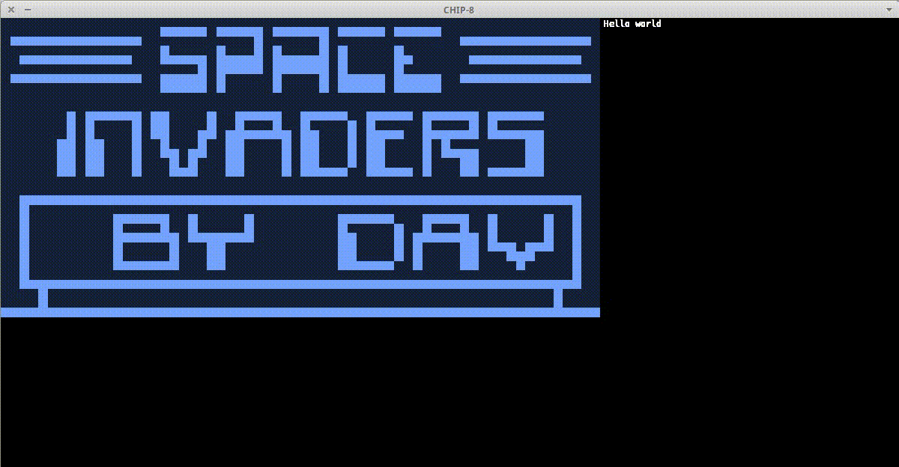

# chip8
A complete CHIP-8 emulator in Rust, which runs most ROMS you can find in the wild.
It keeps the CPU at 500 Hz, and draws onto the screen at 60 Hz.

## Running
Execute `cargo run filename`, where `filename` is a file in the [`roms`](roms) directory.

## CPU
Implemented in [chip8.rs](src/chip8.rs).
The [`cycle`](src/chip8.rs#L124) function is where most things happen:
two bytes are fetched from the program counter, timers are delayed if necessary (at 60 Hz as per spec), and the CPU branches depending on the instruction fetched.

The [`load_rom`](src/chip8.rs#L252) function reads and copies a ROM file and in-memory, starting at the program base pointer, at `0x200`.

Each instruction is implemented in its own function in that same file.

## Display
The CPU writes onto a 64x32 array that represents video memory.
A display implementation must read from this array and upscale the source to get something visualizable.
This project provides an SFML-based implementation; take a look at [`display.rs`](src/display.rs) for the `Display` trait definition,
and [`display_sfml.rs`](src/display_sfml.rs) for our implementation.

## Sound
The CHIP-8 specification requires a single 'beep' sound, which plays as long as the sound timer is not zero.
We generate 0.5 seconds of a pure sine wave, which is a bid ad-hoc, but has worked well so far.

## Roms
The [`roms`](roms) folder contains a collection of ROMS from [this project](https://github.com/badlogic/chip8/tree/master/roms):
all credits due to the respective authors.

## Todo
- [ ] Debugger.
- [ ] Assembler/disassembler (from/to [Chipper](https://github.com/mwales/chip8/blob/master/chipper/CHIPPER.DOC)).
